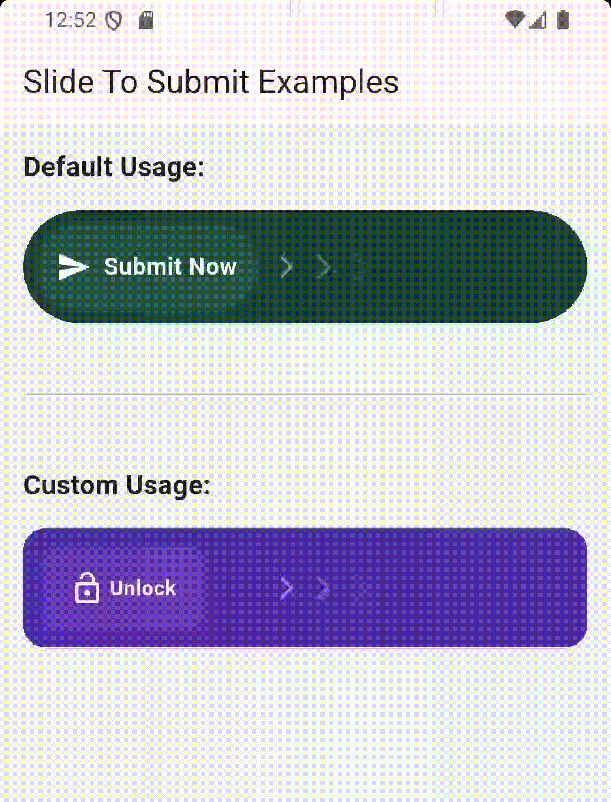

# Slide To Submit

A highly customizable and animated slide-to-submit button for your Flutter applications. This widget provides a sleek and intuitive way for users to confirm actions.

---

## ✨ Features

- Smooth sliding animation
- Bouncy return animation on release
- Customizable text and styling
- Callback on successful submission
- Animated arrow indicator

---

## 🚀 Getting Started

### Installation

In your `pubspec.yaml` file, add the following dependency:

```yaml
dependencies:
  slide_to_submit: ^1.0.0
```

Then, run:

```bash
flutter pub get
```

---

## 🔧 Usage

Here's a simple example of how to use the `SlideToSubmit`:

```dart
import 'package:flutter/material.dart';
import 'package:slide_to_submit/slide_to_submit.dart';

void main() {
  runApp(const MyApp());
}

class MyApp extends StatelessWidget {
  const MyApp({super.key});

  @override
  Widget build(BuildContext context) {
    return MaterialApp(
      home: Scaffold(
        appBar: AppBar(
          title: const Text('Slide To Submit Example'),
        ),
        body: Center(
          child: SlideToSubmit(
            onSubmit: () {
              print("Submitted!");
            },
          ),
        ),
      ),
    );
  }
}
```

---

## 🎨 Customization

The `SlideToSubmit` widget offers two constructors: a **default constructor** for quick use and a **custom constructor** for full control.

### Default Constructor

| Property          | Type                 | Description                                                    |
| ----------------- | -------------------- | -------------------------------------------------------------- |
| `onSubmit`        | `VoidCallback`       | **Required.** Callback triggered on successful submission.     |
| `text`            | `String?`            | Optional label inside the slider.                              |
| `textStyle`       | `TextStyle`          | Style for the slider text.                                     |
| `sliderIcon`      | `IconData?`          | Icon shown in the slider.                                      |
| `sliderIconColor` | `Color`              | Colour of the icon inside the slider.                          |
| `backgroundColor` | `Color`              | Background color of the full widget.                           |
| `foregroundColor` | `Color`              | Foreground (slider) color.                                     |
| `borderRadius`    | `BorderRadius`       | Corner radius for both background and slider.                  |
| `height`          | `double`             | Total height of the widget.                                    |
| `sliderWidth`     | `double`             | Width of the draggable slider.                                 |
| `threshold`       | `double`             | Ratio of slide distance needed to trigger submit (0.0 to 1.0). |
| `bounceDuration`  | `Duration`           | Duration of bounce-back animation when not submitted.          |
| `showArrow`       | `bool`               | Whether to show an animated arrow hint.                        |
| `padding`         | `EdgeInsetsGeometry` | Padding around the widget.                                     |

### Custom Constructor (`SlideToSubmit.custom`)

Use this when you want to design your own slider widget.

| Property               | Type                 | Description                                                |
| ---------------------- | -------------------- | ---------------------------------------------------------- |
| `onSubmit`             | `VoidCallback`       | **Required.** Callback triggered on successful submission. |
| `slider`               | `Widget`             | **Required.** Your own custom slider widget.               |
| `sliderWidth`          | `double`             | Width of your custom slider.                               |
| `backgroundDecoration` | `BoxDecoration`      | Decoration for the outer container.                        |
| `foregroundDecoration` | `BoxDecoration`      | Decoration for the slider.                                 |
| `hint`                 | `Widget?`            | Optional hint like an arrow or label.                      |
| `height`               | `double`             | Height of the widget.                                      |
| `threshold`            | `double`             | Ratio of slide distance needed to trigger submit.          |
| `bounceDuration`       | `Duration`           | Duration of bounce-back animation.                         |
| `padding`              | `EdgeInsetsGeometry` | Padding around the widget.                                 |

---

## 📷 Screenshots



---

## 💡 Example

Check out the `example/` directory for a full working implementation.

---

## 🛠️ Contributing

This package is open source. Contributions are welcome!

- Fork the repository
- Create a feature branch
- Commit your changes
- Open a pull request

---

## 📄 License

[MIT](LICENSE) © Abdullah Al Mamun

---

## 👥 Maintainer

- [Abdullah Al Mamun](https://github.com/AbdullahAlMamun12)

---

> Made with ❤️ using Flutter.